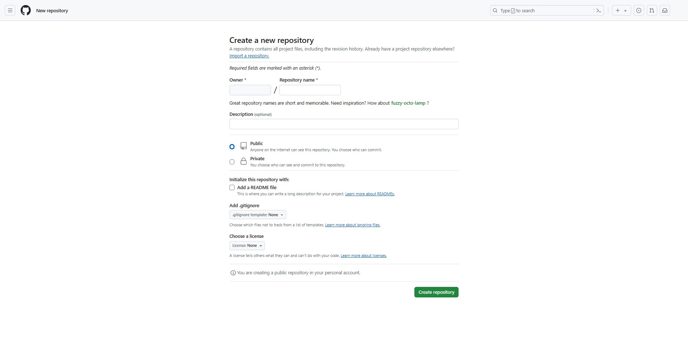

[](https://squidfunk.github.io/mkdocs-material/)

# Welcome to MkDocs

For full documentation visit [mkdocs.org](https://www.mkdocs.org).

## Commands

* `mkdocs new [dir-name]` - Create a new project.
* `mkdocs serve` - Start the live-reloading docs server.
* `mkdocs build` - Build the documentation site.
* `mkdocs -h` - Print help message and exit.
* `pip install --upgrade --force-reinstall mkdocs-material` - Upgrade to the latest version.
* `pip show mkdocs-material` - Show the currently installed version.

## Project layout

    mkdocs.yml    # The configuration file.
    docs/
        index.md  # The documentation homepage.
        ...       # Other markdown pages, images and other files.

## Creating virtual environment

``` Powershell
PS .\mkdocs> virtualenv env
PS .\mkdocs> Set-ExecutionPolicy -Scope Process -ExecutionPolicy Bypass
PS .\mkdocs> .\env\Scripts\Activate
```

## Publishing your site

``` Powershell hl_lines="5"
(env) PS .\mkdocs> mkdocs gh-deploy --force
INFO    -  Cleaning site directory
INFO    -  Building documentation to directory: .\mkdocs\site
INFO    -  Documentation built in 0.84 seconds
ERROR   -  Cannot deploy - this directory does not appear to be a git repository
WARNING -  Version check skipped: No version specified in previous deployment.
INFO    -  Copying '.\mkdocs\site' to 'gh-pages' branch and pushing to GitHub.
ERROR   -  Failed to deploy to GitHub with error:
        not a git repository (or any of the parent directories): .git

Deployment Aborted!
```

## Initialize Git repository

``` Powershell
(env) PS .\mkdocs> git init
Initialized empty Git repository in ./mkdocs/.git/
```

## Republishing your site

``` Powershell hl_lines="7-11"
(env) PS .\mkdocs> mkdocs gh-deploy --force
INFO    -  Cleaning site directory
INFO    -  Building documentation to directory: .\mkdocs\site
INFO    -  Documentation built in 1.30 seconds
WARNING -  Version check skipped: No version specified in previous deployment.
INFO    -  Copying '.\mkdocs\site' to 'gh-pages' branch and pushing to GitHub.
fatal: 'origin' does not appear to be a git repository
fatal: Could not read from remote repository.

Please make sure you have the correct access rights
and the repository exists.
Traceback (most recent call last):
File ".\Anaconda3\lib\runpy.py", line 193, in _run_module_as_main
    "__main__", mod_spec)
File ".\Anaconda3\lib\runpy.py", line 85, in _run_code
    exec(code, run_globals)
File ".\mkdocs\env\Scripts\mkdocs.exe\__main__.py", line 7, in <module>
File ".\mkdocs\env\lib\site-packages\click\core.py", line 1157, in __call__
    return self.main(*args, **kwargs)
File ".\mkdocs\env\lib\site-packages\click\core.py", line 1078, in main
    rv = self.invoke(ctx)
File ".\mkdocs\env\lib\site-packages\click\core.py", line 1688, in invoke
    return _process_result(sub_ctx.command.invoke(sub_ctx))
File ".\mkdocs\env\lib\site-packages\click\core.py", line 1434, in invoke
    return ctx.invoke(self.callback, **ctx.params)
File ".\mkdocs\env\lib\site-packages\click\core.py", line 783, in invoke
    return __callback(*args, **kwargs)
File ".\mkdocs\env\lib\site-packages\mkdocs\__main__.py", line 322, in gh_deploy_command
    shell=shell,
File ".\mkdocs\env\lib\site-packages\mkdocs\commands\gh_deploy.py", line 138, in gh_deploy
    nojekyll=True,
File ".\mkdocs\env\lib\site-packages\ghp_import.py", line 283, in ghp_import
    git.check_call('push', opts['remote'], opts['branch'], '--force')
File ".\mkdocs\env\lib\site-packages\ghp_import.py", line 119, in check_call
    sp.check_call(['git'] + list(args), **kwargs)
File ".\Anaconda3\lib\subprocess.py", line 347, in check_call
    raise CalledProcessError(retcode, cmd)
subprocess.CalledProcessError: Command '['git', 'push', 'origin', 'gh-pages', '--force']' returned non-zero exit status 128.
```

## Create GitHub new repository

{data-gallery="repository"}

**Create a new repository**

A repository contains all project files, including the revision history. Already have a project repository elsewhere?

[^^Import a repository^^][example].

---
*Required fields are marked with an asterisk (\*).*

Owner^*^&emsp;&emsp;&emsp;&emsp;&emsp;&emsp;&emsp;&emsp;&emsp;&emsp;&emsp;&ensp; / Repository name^*^

!!! note inline ""
    *Owner*
!!! note inline ""
    *Repository name*
.

---

Great repository names are short and memorable. Need inspiration?How about [***fuaay-octo-lamp***][example]?

**Description** (optional)

!!! note ""
    *Description*

---
- [x] **Public**
    - Anyone on the internet can see this repository. You choose who can commit.
- [ ] **Private**
    - You choose who can see and commit to this repository.

---
**Initialize this repository with:**

- [ ] **Add a README file**
    - This is where you can write a long description for your project. [^^Learn more about READMEs^^][example].

**Add .gitignore**

!!! note inline ""
    *.gitignore template:None*
Choose which files not to track from a list of templates. [^^Learn more about ignoring files^^][example].

**Choose a license**

!!! note inline ""
    *License:None*
A license tells others what they can and can't do with your code. [^^Learn more about licenses^^][example].

---

:bootstrap-material-information-outline:{ title="Important information" } You are creating a public repository in your personal account.

---

### Remote repository commands

* `git remote -v` - View existing remote repository settings.
* `git remote set-url origin <new_url>` - Update the URL of the remote repository.
* `git remote rm origin` - Delete existing remote repository.

## Link to GitHub repository

In the local Git repository, you need to add a reference to the remote repository:

``` Powershell
git remote add origin https://github.com/your-username/mkdocs.git
```

Please replace `your-username` with your GitHub username.

## Push to GitHub

Firstly, ensure that your local changes have been committed, all changes have been committed to **Git**:

``` Powershell
git add .
```

Each commit should have a concise but descriptive commit message so that other developers can clearly understand the changes or issues addressed by each commit.By using the -m option, you can directly specify the commit message on the command line.

``` Powershell
git commit -m "Initial commit"
git commit -m "Fix mkdocs.yml configuration issues"
```

Then, push your code to GitHub:

``` Powershell
git push -u origin master
```

!!! note

    `-u` or `--set-upstream`: This option tells **Git** to set up an upstream branch for tracking. After setting up the tracking branch, you can use commands such as `git push` and `git pull`, without explicitly specifying the names of remote and local branches each time. In this command, there is no parameter provided after the `-u` option, which means you want to associate the current branch with the **master** branch of the remote warehouse.

When it is determined that the GitHub library is empty or the original GitHub library file can be lost, the `-f` command can be used to force the push of documents to GitHub Pages.

``` Powershell
git push -f origin master
```

??? note

    Be cautious when using the `--force` option as it may lead to unnecessary website deployment and push. Usually, this option is only used when you are certain that you want to force updates to website content on **GitHub Pages**.

## Use MkDocs to publish your site to GitHub Pages

``` Powershell
mkdocs gh-deploy
```

This command will build your site and push the built static files to the `gh-pages` branch of your repository.

After completing these steps, your **MkDocuments** site will be published on **GitHub Pages** and can be accessed through methods similar to ***https://your-username.github.io/mkdocs/*** Access your site through the **URL**.

``` Powershell
mkdocs gh-deploy --force
```

Of course, it can also be forcibly pushed.

## Summary

### Project environment construction

**Building a virtual environment**

``` PowerShell hl_lines="2-6"
PS G:\Directory> virtualenv env
created virtual environment CPython3.7.4.final.0-64 in 15450ms
  creator CPython3Windows(dest=G:\Directory\env, clear=False, no_vcs_ignore=False, global=False)
  seeder FromAppData(download=False, pip=bundle, setuptools=bundle, wheel=bundle, via=copy, app_data_dir=C:\Directory\AppData\Local\pypa\virtualenv)
    added seed packages: Babel==2.14.0, Jinja2==3.1.3, Markdown==3.4.4, MarkupSafe==2.1.5, PyYAML==6.0.1, certifi==2024.2.2, charset_normalizer==3.3.2, click==8.1.7, colorama==0.4.6, et_xmlfile==1.1.0, ghp_import==2.1.0, idna==3.7, importlib_metadata==6.7.0, mergedeep==1.3.4, mkdocs==1.5.3, mkdocs_glightbox==0.3.7, mkdocs_material==9.2.7, mkdocs_material_extensions==1.2, mkdocs_table_reader_plugin==2.0.3, numpy==1.21.6, openpyxl==3.1.2, packaging==24.0, paginate==0.5.6, pandas==1.3.5, pathspec==0.11.2, pip==24.0, platformdirs==4.0.0, pygments==2.17.2, pymdown_extensions==10.2.1, python_dateutil==2.9.0.post0, pytz==2024.1, pyyaml_env_tag==0.1, regex==2022.10.31, requests==2.31.0, setuptools==68.0.0, six==1.16.0, tabulate==0.9.0, typing_extensions==4.7.1, urllib3==2.0.7, watchdog==3.0.0, wheel==0.42.0, zipp==3.15.0
  activators BashActivator,BatchActivator,FishActivator,NushellActivator,PowerShellActivator,PythonActivator
```

Use the **PowerShell** command to set the execution policy of the current process to `Bypass`[^1].

[^1]: The purpose of the entire command is to set the execution policy to `Bypass` in the current **PowerShell** process, so that any script can be executed without being restricted by the execution policy. This may be useful in situations where untrusted scripts need to be executed, but it also increases **security risks** as it reduces the security of **PowerShell** script execution.

``` PowerShell
PS G:\Directory> Set-ExecutionPolicy -Scope Process -ExecutionPolicy Bypass
```

Then we activate the virtual environment and use `cd .\Mkdocs\` command enters the project documentation.

``` PowerShell
PS G:\Directory> .\env\Scripts\Activate
PS G:\Directory> cd .\Mkdocs\
```

**Establish a remote connection and deploy the project through GitHub**

``` PowerShell hl_lines="4 8 9 12 13 15"
(env) PS G:\Directory\Mkdocs> git remote rm origin
(env) PS G:\Directory\Mkdocs> git remote -v
(env) PS G:\Directory\Mkdocs> git init
Reinitialized existing Git repository in G:/Directory/Mkdocs/.git/
(env) PS G:\Directory\Mkdocs> git config core.autocrlf true
(env) PS G:\Directory\Mkdocs> git add .
(env) PS G:\Directory\Mkdocs> git commit -m "20240511 2.0 Fix mkdocs.yml 'npm install glightbox' configuration issues"
On branch master
nothing to commit, working tree clean
(env) PS G:\Directory\Mkdocs> git remote add origin https://github.com/name/Mkdocs.git
(env) PS G:\Directory\Mkdocs> git push -u origin master
branch 'master' set up to track 'origin/master'.
Everything up-to-date
(env) PS G:\Directory\Mkdocs> git push -f origin master
Everything up-to-date
```

**Deploy through Mkdocs Github-Pages**

``` PowerShell hl_lines="2-43"
(env) PS G:\Directory\Mkdocs> mkdocs gh-deploy
INFO    -  Cleaning site directory
INFO    -  Building documentation to directory: G:\Directory\Mkdocs\site
INFO    -  The following pages exist in the docs directory, but are not included in the "nav" configuration:
             - index.md
INFO    -  Documentation built in 2.33 seconds
INFO    -  Copying 'G:\Directory\Mkdocs\site' to 'gh-pages' branch and pushing to GitHub.
Enumerating objects: 88, done.
Counting objects: 100% (88/88), done.
Delta compression using up to 4 threads
Compressing objects: 100% (56/56), done.
Writing objects: 100% (80/80), 166.18 KiB | 2.56 MiB/s, done.
Total 80 (delta 37), reused 0 (delta 0), pack-reused 0 (from 0)
error: RPC failed; HTTP 400 curl 22 The requested URL returned error: 400
send-pack: unexpected disconnect while reading sideband packet
fatal: the remote end hung up unexpectedly
Everything up-to-date
Traceback (most recent call last):
  File "C:\Directory\Anaconda3\lib\runpy.py", line 193, in _run_module_as_main
    "__main__", mod_spec)
  File "C:\Directory\Anaconda3\lib\runpy.py", line 85, in _run_code
    exec(code, run_globals)
  File "G:\Directory\env\Scripts\mkdocs.exe\__main__.py", line 7, in <module>
  File "G:\Directory\env\lib\site-packages\click\core.py", line 1157, in __call__
    return self.main(*args, **kwargs)
  File "G:\Directory\env\lib\site-packages\click\core.py", line 1078, in main
  File "G:\Directory\env\lib\site-packages\click\core.py", line 1688, in invoke
    return _process_result(sub_ctx.command.invoke(sub_ctx))
  File "G:\Directory\env\lib\site-packages\click\core.py", line 1434, in invoke
    return ctx.invoke(self.callback, **ctx.params)
  File "G:\Directory\env\lib\site-packages\click\core.py", line 783, in invoke
    return __callback(*args, **kwargs)
  File "G:\Directory\env\lib\site-packages\mkdocs\__main__.py", line 322, in gh_deploy_command
    shell=shell,
  File "G:\Directory\env\lib\site-packages\mkdocs\commands\gh_deploy.py", line 138, in gh_deploy
    nojekyll=True,
  File "G:\Directory\env\lib\site-packages\ghp_import.py", line 285, in ghp_import
    git.check_call('push', opts['remote'], opts['branch'])
  File "G:\Directory\env\lib\site-packages\ghp_import.py", line 119, in check_call
    sp.check_call(['git'] + list(args), **kwargs)
  File "C:\Directory\Anaconda3\lib\subprocess.py", line 347, in check_call
    raise CalledProcessError(retcode, cmd)
subprocess.CalledProcessError: Command '['git', 'push', 'origin', 'gh-pages']' returned non-zero exit status 1.
```

``` PowerShell hl_lines="2-17"
(env) PS G:\Directory\Mkdocs> mkdocs gh-deploy --force
INFO    -  Cleaning site directory
INFO    -  Building documentation to directory: G:\Directory\Mkdocs\site
INFO    -  The following pages exist in the docs directory, but are not included in the "nav" configuration:
             - index.md
INFO    -  Documentation built in 2.28 seconds
INFO    -  Copying 'G:\Directory\Mkdocs\site' to 'gh-pages' branch and pushing to GitHub.
Enumerating objects: 91, done.
Counting objects: 100% (91/91), done.
Delta compression using up to 4 threads
Compressing objects: 100% (59/59), done.
Writing objects: 100% (83/83), 166.06 KiB | 2.86 MiB/s, done.
Total 83 (delta 39), reused 0 (delta 0), pack-reused 0 (from 0)
remote: Resolving deltas: 100% (39/39), completed with 3 local objects.
To https://github.com/name/Mkdocs.git
   cc47679..7d9de8d  gh-pages -> gh-pages
INFO    -  Your documentation should shortly be available at: https://name.github.io/Mkdocs/
```

**Local build and serve of Mkdocs**

The `mkdocs build`[^2] is used to build the **MkDocs** project and convert **Markdown** files into static **HTML** websites. It will render the **Markdown** file into an **HTML** page based on the content and configuration specified in the configuration file (default is *mkdocs.yml*), and store it in the specified output directory (default is the **site** directory).

[^2]:The `mkdocs build` only performs a one-time build operation and exits after generating a static website. The generated static website files are stored in the output directory and can be deployed to a **Web** server for access.

``` PowerShell hl_lines="2-4"
(env) PS G:\Directory\Mkdocs> mkdocs build
INFO    -  Cleaning site directory
INFO    -  Building documentation to directory: G:\Directory\Mkdocs\site
INFO    -  Documentation built in 0.23 seconds
```

The `mkdocs serve`[^3] is used to launch a development server locally for previewing **Mkdocs** projects in a browser. It will listen to the specified port (default is **8000**) and render **Markdown** files into **HTML** pages in real-time. At the same time, it also provides an automatic reload function, which means that when the **Markdown** file changes, the browser will automatically reload to display the updated content.

[^3]:The `mkdocs serve` not only generates static websites, but also launches a **Web** server locally, making it convenient for developers to preview and debug projects in real-time. This server is usually used during the development phase so that developers can immediately see the effects when writing documents and adjusting styles.

``` PowerShell hl_lines="2-7"
(env) PS G:\Directory\Mkdocs> mkdocs serve
INFO    -  Building documentation...
INFO    -  Cleaning site directory
INFO    -  Documentation built in 0.17 seconds
INFO    -  [18:31:28] Watching paths for changes: 'docs', 'mkdocs.yml'
INFO    -  [18:31:28] Serving on http://127.0.0.1:8000/
INFO    -  Shutting down...
```

**Address**

* https://github.com/name/Mkdocs.git - GitHub repository address.
* https://name.github.io/Mkdocs/ - URL address.
* http://127.0.0.1:8000/ - Local address.

### Problems encountered

**Error 1: Failed to connect to github.com port 443**

``` PowerShell
fatal: unable to access 'https://github.com/name/Mkdocs.git/': Failed to connect to github.com port 443 after 21096 ms: Couldn't connect to server
```

**Reason:**

* **Network issue:** It may be due to unstable network connection or network configuration issues that prevent connection to port **443** (**HTTPS** port) of the **GitHub** server.

* **Firewall or proxy:** Your network environment may have a firewall or proxy blocking **HTTPS** connections to external parties.

**Error 2: OpenSSL SSL_read: SSL_ERROR_SYSCALL, errno 0**

``` PowerShell
fatal: unable to access 'https://github.com/name/Mkdocs.git/': OpenSSL SSL_read: SSL_ERROR_SYSCALL, errno 0
```

**Reason:**

* **SSL/TLS connection issue:** This is usually due to **SSL/TLS** connection interruption or failure, which may be due to incorrect **SSL** configuration or network issues.

## Git commands

``` PowerShell
(env) PS G:\Directory\Mkdocs> git --help
usage: git [-v | --version] [-h | --help] [-C <path>] [-c <name>=<value>]
           [--exec-path[=<path>]] [--html-path] [--man-path] [--info-path]
           [-p | --paginate | -P | --no-pager] [--no-replace-objects] [--bare]
           [--git-dir=<path>] [--work-tree=<path>] [--namespace=<name>]
           [--config-env=<name>=<envvar>] <command> [<args>]

These are common Git commands used in various situations:

start a working area (see also: git help tutorial)
   clone     Clone a repository into a new directory
   init      Create an empty Git repository or reinitialize an existing one

work on the current change (see also: git help everyday)
   add       Add file contents to the index
   mv        Move or rename a file, a directory, or a symlink
   restore   Restore working tree files
   rm        Remove files from the working tree and from the index

examine the history and state (see also: git help revisions)
   bisect    Use binary search to find the commit that introduced a bug
   diff      Show changes between commits, commit and working tree, etc
   grep      Print lines matching a pattern
   log       Show commit logs
   show      Show various types of objects
   status    Show the working tree status

grow, mark and tweak your common history
   branch    List, create, or delete branches
   commit    Record changes to the repository
   merge     Join two or more development histories together
   rebase    Reapply commits on top of another base tip
   reset     Reset current HEAD to the specified state
   switch    Switch branches
   tag       Create, list, delete or verify a tag object signed with GPG

collaborate (see also: git help workflows)
   fetch     Download objects and refs from another repository
   pull      Fetch from and integrate with another repository or a local branch
   push      Update remote refs along with associated objects

'git help -a' and 'git help -g' list available subcommands and some
concept guides. See 'git help <command>' or 'git help <concept>'
to read about a specific subcommand or concept.
See 'git help git' for an overview of the system.
```