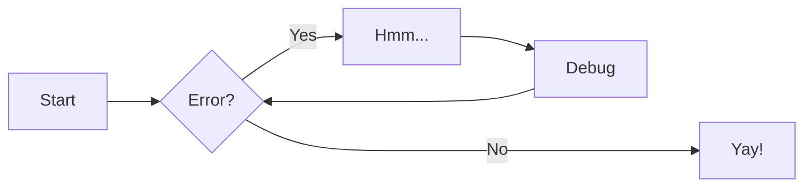
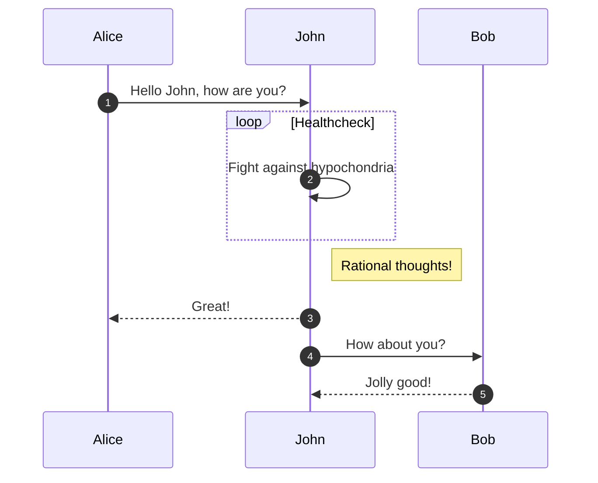
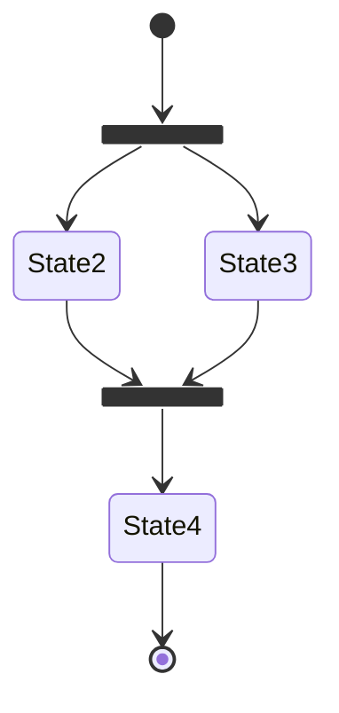
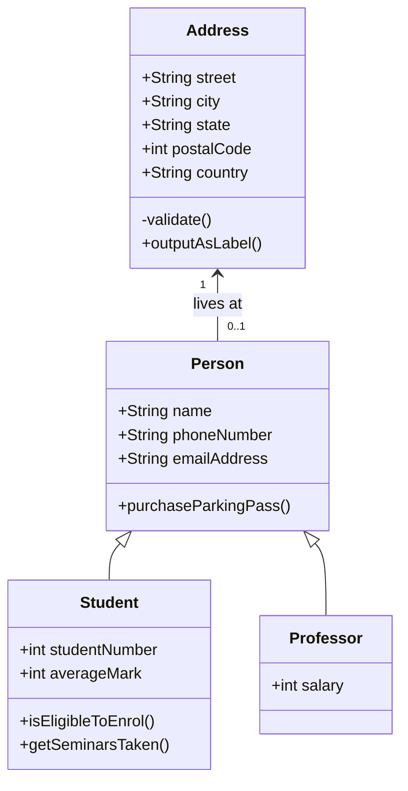
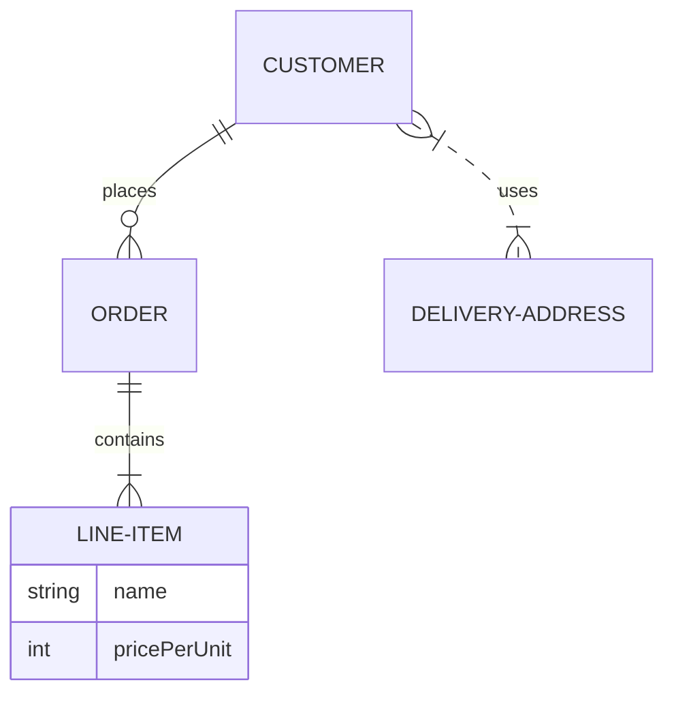

# Admonition

!!! note

    Lorem ipsum dolor sit amet, consectetur adipiscing elit. Nulla et euismod
    nulla. Curabitur feugiat, tortor non consequat finibus, justo purus auctor
    massa, nec semper lorem quam in massa.

!!! note "Phasellus posuere in sem ut cursus"

    Lorem ipsum dolor sit amet, consectetur adipiscing elit. Nulla et euismod
    nulla. Curabitur feugiat, tortor non consequat finibus, justo purus auctor
    massa, nec semper lorem quam in massa.

!!! note ""

    Lorem ipsum dolor sit amet, consectetur adipiscing elit. Nulla et euismod
    nulla. Curabitur feugiat, tortor non consequat finibus, justo purus auctor
    massa, nec semper lorem quam in massa.

??? note

    Lorem ipsum dolor sit amet, consectetur adipiscing elit. Nulla et euismod
    nulla. Curabitur feugiat, tortor non consequat finibus, justo purus auctor
    massa, nec semper lorem quam in massa.

???+ note

    Lorem ipsum dolor sit amet, consectetur adipiscing elit. Nulla et euismod
    nulla. Curabitur feugiat, tortor non consequat finibus, justo purus auctor
    massa, nec semper lorem quam in massa.

!!! info inline end "Lorem ipsum"

    Lorem ipsum dolor sit amet, consectetur
    adipiscing elit. Nulla et euismod nulla.
    Curabitur feugiat, tortor non consequat
    finibus, justo purus auctor massa, nec
    semper lorem quam in massa.

!!! info inline "Lorem ipsum"

    Lorem ipsum dolor sit amet, consectetur
    adipiscing elit. Nulla et euismod nulla.
    Curabitur feugiat, tortor non consequat
    finibus, justo purus auctor massa, nec
    semper lorem quam in massa.

```
INFO    -  The following pages exist in the docs directory, but are not included in the "nav" configuration:
             - index.md
             - blog\index.md
INFO    -  Documentation built in 0.94 seconds
INFO    -  [22:02:53] Reloading browsers
WARNING -  [22:02:54] "GET /versions.json HTTP/1.1" code 404
WARNING -  [22:02:55] "GET /versions.json HTTP/1.1" code 404
INFO    -  [22:02:55] Browser connected: http://127.0.0.1:8000/MetaByte-Metrics/
```

!!! note
    If you are using a newer version of **Git**, you may need to use `main` instead of `master` as the main branch name.

!!! abstract
    If you are using a newer version of **Git**, you may need to use `main` instead of `master` as the main branch name.

!!! info
    If you are using a newer version of **Git**, you may need to use `main` instead of `master` as the main branch name.

!!! tip
    If you are using a newer version of **Git**, you may need to use `main` instead of `master` as the main branch name.

!!! success
    If you are using a newer version of **Git**, you may need to use `main` instead of `master` as the main branch name.

!!! question
    If you are using a newer version of **Git**, you may need to use `main` instead of `master` as the main branch name.

!!! warning
    If you are using a newer version of **Git**, you may need to use `main` instead of `master` as the main branch name.

!!! failure
    If you are using a newer version of **Git**, you may need to use `main` instead of `master` as the main branch name.

!!! danger
    If you are using a newer version of **Git**, you may need to use `main` instead of `master` as the main branch name.

!!! bug
    If you are using a newer version of **Git**, you may need to use `main` instead of `master` as the main branch name.

!!! example
    If you are using a newer version of **Git**, you may need to use `main` instead of `master` as the main branch name.

!!! quote
    If you are using a newer version of **Git**, you may need to use `main` instead of `master` as the main branch name.

## Emoji test

:smile:

:bootstrap-fontawesome-regular-face-laugh-wink:

:bootstrap-fontawesome-brands-youtube:{ .youtube }

:bootstrap-octicons-heart-fill-24:{ .heart }

## Chinese search test

欢迎您访问 **MetaByte-Metrics** ，我们将竭尽全力为您提供 **优质**、**快捷**、**高效** 的服务。请留下您 **宝贵的反馈意见**，我们将根据您的反馈酌情优化 **MetaByte-Metrics** ，使您获得更美好的体验。

## Summary of correction issues

* 1、Segmentation jiba.
* 2、Emoji.
* 3、Search false/true, lang:zh/en, table.
* 4、Tags.

Lorem ipsum dolor sit amet, (1) consectetur adipiscing elit.
{ .annotate }

1.  :man_raising_hand: I'm an annotation! I can contain `code`, __formatted
    text__, images, ... basically anything that can be expressed in Markdown.

Lorem ipsum dolor sit amet, (1) consectetur adipiscing elit.
{ .annotate }

1.  :man_raising_hand: I'm an annotation! (1)
    { .annotate }

    1.  :woman_raising_hand: I'm an annotation as well!

!!! note annotate "Phasellus posuere in sem ut cursus (1)"

    Lorem ipsum dolor sit amet, (2) consectetur adipiscing elit. Nulla et
    euismod nulla. Curabitur feugiat, tortor non consequat finibus, justo
    purus auctor massa, nec semper lorem quam in massa.

1.  :man_raising_hand: I'm an annotation!
2.  :woman_raising_hand: I'm an annotation as well!

=== "Tab 1"

    Lorem ipsum dolor sit amet, (1) consectetur adipiscing elit.
    { .annotate }

    1.  :man_raising_hand: I'm an annotation!

=== "Tab 2"

    Phasellus posuere in sem ut cursus (1)
    { .annotate }

    1.  :woman_raising_hand: I'm an annotation as well!

<div class="annotate" markdown>

> Lorem ipsum dolor sit amet, (1) consectetur adipiscing elit.

</div>

1.  :man_raising_hand: I'm an annotation!

<div class="grid cards" markdown>

- :bootstrap-fontawesome-brands-html5: __HTML__ for content and structure
- :bootstrap-fontawesome-brands-js: __JavaScript__ for interactivity
- :bootstrap-fontawesome-brands-css3: __CSS__ for text running out of boxes
- :bootstrap-fontawesome-brands-internet-explorer: __Internet Explorer__ ... huh?

</div>

<div class="grid cards" markdown>

-   :bootstrap-material-clock-fast:{ .lg .middle } __Set up in 5 minutes__

    ---

    Install [`mkdocs-material`](#) with [`pip`](#) and get up
    and running in minutes

    [:bootstrap-octicons-arrow-right-24: Getting started](#)

-   :bootstrap-fontawesome-brands-markdown:{ .lg .middle } __It's just Markdown__

    ---

    Focus on your content and generate a responsive and searchable static site

    [:bootstrap-octicons-arrow-right-24: Reference](#)

-   :bootstrap-material-format-font:{ .lg .middle } __Made to measure__

    ---

    Change the colors, fonts, language, icons, logo and more with a few lines

    [:bootstrap-octicons-arrow-right-24: Customization](#)

-   :bootstrap-material-scale-balance:{ .lg .middle } __Open Source, MIT__

    ---

    Material for MkDocs is licensed under MIT and available on [GitHub]

    [:bootstrap-octicons-arrow-right-24: License](#)

</div>

<div class="grid" markdown>

:bootstrap-fontawesome-brands-html5: __HTML__ for content and structure
{ .card }

:bootstrap-fontawesome-brands-js: __JavaScript__ for interactivity
{ .card }

:bootstrap-fontawesome-brands-css3: __CSS__ for text running out of boxes
{ .card }

> :bootstrap-fontawesome-brands-internet-explorer: __Internet Explorer__ ... huh?

</div>

<div class="grid" markdown>

=== "Unordered list"

    * Sed sagittis eleifend rutrum
    * Donec vitae suscipit est
    * Nulla tempor lobortis orci

=== "Ordered list"

    1. Sed sagittis eleifend rutrum
    2. Donec vitae suscipit est
    3. Nulla tempor lobortis orci

``` title="Content tabs"
=== "Unordered list"

    * Sed sagittis eleifend rutrum
    * Donec vitae suscipit est
    * Nulla tempor lobortis orci

=== "Ordered list"

    1. Sed sagittis eleifend rutrum
    2. Donec vitae suscipit est
    3. Nulla tempor lobortis orci
```

</div>

[Subscribe to our newsletter](#){ .md-button }

[Subscribe to our newsletter](#){ .md-button .md-button--primary }

[Send :bootstrap-fontawesome-solid-paper-plane:](#){ .md-button }

[Hover me](https://example.com "I'm a tooltip!")

[Hover me][example]

  [example]: https://example.com "I'm a tooltip!"

:bootstrap-material-information-outline:{ title="Important information" }

The HTML specification is maintained by the W3C.

*[HTML]: Hyper Text Markup Language
*[W3C]: World Wide Web Consortium

:smile:

:bootstrap-logo:

:bootstrap-material-check:

:bootstrap-material-check-all:

:bootstrap-material-close:

:bootstrap-fontawesome-regular-face-laugh-wink:

:bootstrap-fontawesome-brands-youtube:{ .youtube }

:bootstrap-octicons-heart-fill-24:{ .heart }

<span class="twemoji">
   
</span>

{ align=left }

Lorem ipsum dolor sit amet, consectetur adipiscing elit. Nulla et euismod nulla. Curabitur feugiat, tortor non consequat finibus, justo purus auctor massa, nec semper lorem quam in massa.

{ align=right }

Lorem ipsum dolor sit amet, consectetur adipiscing elit. Nulla et euismod nulla. Curabitur feugiat, tortor non consequat finibus, justo purus auctor massa, nec semper lorem quam in massa.

<figure markdown="span">
  { width="300" }
  <figcaption>Image caption</figcaption>
</figure>

{ loading=lazy }


- Nulla et rhoncus turpis. Mauris ultricies elementum leo. Duis efficitur
  accumsan nibh eu mattis. Vivamus tempus velit eros, porttitor placerat nibh
  lacinia sed. Aenean in finibus diam.

    * Duis mollis est eget nibh volutpat, fermentum aliquet dui mollis.
    * Nam vulputate tincidunt fringilla.
    * Nullam dignissim ultrices urna non auctor.

1.  Vivamus id mi enim. Integer id turpis sapien. Ut condimentum lobortis
    sagittis. Aliquam purus tellus, faucibus eget urna at, iaculis venenatis
    nulla. Vivamus a pharetra leo.

    1.  Vivamus venenatis porttitor tortor sit amet rutrum. Pellentesque aliquet
        quam enim, eu volutpat urna rutrum a. Nam vehicula nunc mauris, a
        ultricies libero efficitur sed.

    2.  Morbi eget dapibus felis. Vivamus venenatis porttitor tortor sit amet
        rutrum. Pellentesque aliquet quam enim, eu volutpat urna rutrum a.

        1.  Mauris dictum mi lacus
        2.  Ut sit amet placerat ante
        3.  Suspendisse ac eros arcu

`Lorem ipsum dolor sit amet`

:   Sed sagittis eleifend rutrum. Donec vitae suscipit est. Nullam tempus
    tellus non sem sollicitudin, quis rutrum leo facilisis.

`Cras arcu libero`

:   Aliquam metus eros, pretium sed nulla venenatis, faucibus auctor ex. Proin
    ut eros sed sapien ullamcorper consequat. Nunc ligula ante.

    Duis mollis est eget nibh volutpat, fermentum aliquet dui mollis.
    Nam vulputate tincidunt fringilla.
    Nullam dignissim ultrices urna non auctor.

- [x] Lorem ipsum dolor sit amet, consectetur adipiscing elit
- [ ] Vestibulum convallis sit amet nisi a tincidunt
    * [x] In hac habitasse platea dictumst
    * [x] In scelerisque nibh non dolor mollis congue sed et metus
    * [ ] Praesent sed risus massa
- [ ] Aenean pretium efficitur erat, donec pharetra, ligula non scelerisque

Lorem ipsum[^1] dolor sit amet, consectetur adipiscing elit.[^2]

[^1]: Lorem ipsum dolor sit amet, consectetur adipiscing elit.

[^2]:
    Lorem ipsum dolor sit amet, consectetur adipiscing elit. Nulla et euismod
    nulla. Curabitur feugiat, tortor non consequat finibus, justo purus auctor
    massa, nec semper lorem quam in massa.

| Method      | Description                          |
| ----------- | ------------------------------------ |
| `GET`       | :bootstrap-material-check:     Fetch resource  |
| `PUT`       | :bootstrap-material-check-all: Update resource |
| `DELETE`    | :bootstrap-material-close:     Delete resource |

| Method      | Description                          |
| :---------- | :----------------------------------- |
| `GET`       | :bootstrap-material-check:     Fetch resource  |
| `PUT`       | :bootstrap-material-check-all: Update resource |
| `DELETE`    | :bootstrap-material-close:     Delete resource |

| Method      | Description                          |
| :---------: | :----------------------------------: |
| `GET`       | :bootstrap-material-check:     Fetch resource  |
| `PUT`       | :bootstrap-material-check-all: Update resource |
| `DELETE`    | :bootstrap-material-close:     Delete resource |

| Method      | Description                          |
| ----------: | -----------------------------------: |
| `GET`       | :bootstrap-material-check:     Fetch resource  |
| `PUT`       | :bootstrap-material-check-all: Update resource |
| `DELETE`    | :bootstrap-material-close:     Delete resource |

| Method      | Description                          |
| ----------- | ------------------------------------ |
| `GET`       | :bootstrap-material-check:     Fetch resource  |
| `PUT`       | :bootstrap-material-check-all: Update resource |
| `DELETE`    | :bootstrap-material-close:     Delete resource |

$$
\operatorname{ker} f=\{g\in G:f(g)=e_{H}\}{\mbox{.}}
$$

\[
\operatorname{ker} f=\{g\in G:f(g)=e_{H}\}{\mbox{.}}
\]

The homomorphism $f$ is injective if and only if its kernel is only the
singleton set $e_G$, because otherwise $\exists a,b\in G$ with $a\neq b$ such
that $f(a)=f(b)$.

The homomorphism \(f\) is injective if and only if its kernel is only the
singleton set \(e_G\), because otherwise \(\exists a,b\in G\) with \(a\neq b\) such
that \(f(a)=f(b)\).

- ==This was marked (highlight)==
- ^^This was inserted (underline)^^
- ~~This was deleted (strikethrough)~~

- H~2~O
- A^T^A

++ctrl+alt+del++

Text can be {--deleted--} and replacement text {++added++}. This can also be
combined into {~~one~>a single~~} operation. {==Highlighting==} is also
possible {>>and comments can be added inline<<}.

{==

Formatting can also be applied to blocks by putting the opening and closing
tags on separate lines and adding new lines between the tags and the content.

==}

``` py
import tensorflow as tf
```

``` py title="bubble_sort.py"
def bubble_sort(items):
    for i in range(len(items)):
        for j in range(len(items) - 1 - i):
            if items[j] > items[j + 1]:
                items[j], items[j + 1] = items[j + 1], items[j]
```

``` yaml
theme:
  features:
    - content.code.annotate # (1)
```

1.  :man_raising_hand: I'm a code annotation! I can contain `code`, __formatted
    text__, images, ... basically anything that can be written in Markdown.

``` yaml
# (1)!
```

1.  Look ma, less line noise!

``` py linenums="3"
def bubble_sort(items):
    for i in range(len(items)):
        for j in range(len(items) - 1 - i):
            if items[j] > items[j + 1]:
                items[j], items[j + 1] = items[j + 1], items[j]
```

``` py hl_lines="2 3"
def bubble_sort(items):
    for i in range(len(items)):
        for j in range(len(items) - 1 - i):
            if items[j] > items[j + 1]:
                items[j], items[j + 1] = items[j + 1], items[j]
```

``` py hl_lines="3-5"
def bubble_sort(items):
    for i in range(len(items)):
        for j in range(len(items) - 1 - i):
            if items[j] > items[j + 1]:
                items[j], items[j + 1] = items[j + 1], items[j]
```

The `#!python range()` function is used to generate a sequence of numbers.

``` title=".browserslistrc"
--8<-- ".browserslistrc"
```

=== "C"

    ``` c
    #include <stdio.h>

    int main(void) {
      printf("Hello world!\n");
      return 0;
    }
    ```

=== "C++"

    ``` c++
    #include <iostream>

    int main(void) {
      std::cout << "Hello world!" << std::endl;
      return 0;
    }
    ```

=== "Unordered list"

    * Sed sagittis eleifend rutrum
    * Donec vitae suscipit est
    * Nulla tempor lobortis orci

=== "Ordered list"

    1. Sed sagittis eleifend rutrum
    2. Donec vitae suscipit est
    3. Nulla tempor lobortis orci

!!! example

    === "Unordered List"

        ``` markdown
        * Sed sagittis eleifend rutrum
        * Donec vitae suscipit est
        * Nulla tempor lobortis orci
        ```

    === "Ordered List"

        ``` markdown
        1. Sed sagittis eleifend rutrum
        2. Donec vitae suscipit est
        3. Nulla tempor lobortis orci
        ```
---










``` PowerShell
fatal: unable to access 'https://github.com/Drenban/MetaByte-Metrics.git/': Failed to connect to github.com port 443 after 21096 ms: Couldn't connect to server

fatal: unable to access 'https://github.com/Drenban/MetaByte-Metrics.git/': OpenSSL SSL_read: SSL_ERROR_SYSCALL, errno 0
```