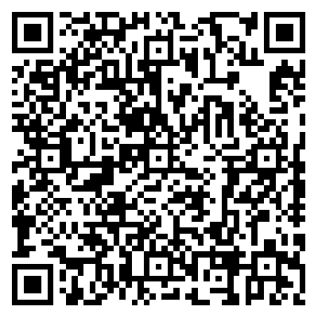

# 来杯咖啡

---

**喜欢这个项目吗？给我买杯咖啡吧！☕️**

在代码的世界里，每一行代码都像一杯热咖啡，为项目注入了活力和能量。如果我的开源项目为你节省了时间，解决了难题，或者给你带来了灵感，那么不妨考虑打赏我 [一杯咖啡]()，以示支持和鼓励。

你的打赏将直接用于项目的开发、维护和改进，帮助我持续地提供优质的代码和服务。而且，[一杯咖啡的小费]() 也是我继续创造更多精彩内容的动力所在。

无论你的打赏金额是多少，我都将由衷地感谢你的支持。每一份支持都让我感到由衷的感激，并激励着我不断前行，不断完善这个项目。
感谢你的支持！让我们一起创造更加美好的开源世界吧！

愿每一杯咖啡都带来源源不断的创意和动力，让我们一起享受代码和咖啡带来的美好时光！

[再次感谢您的慷慨支持！]()

如果你愿意为这个项目买上一杯咖啡，你也可以扫描下方的二维码进行打赏：

[来杯咖啡]()

!!! note inline "一杯 [**DOUBLE**]() 浓美式"

    
    [**个人** 收款码]()