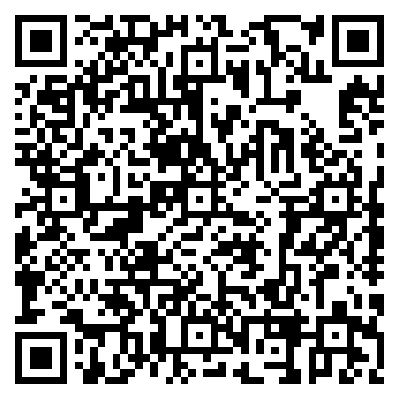

---
hide:
  - feedback
  - navigation
  - toc
---

# 欢迎来到元数据材料

## 联系与合作方式

!!! note inline "联系作者"

    
    [添加 **作者微信**]()

!!! note inline "慷慨打赏"

    
    [**个人微信** 收款码]()

!!! note inline "赞助支持"

    
    [**公司** 收款码(微信/支付宝)]()

#
#
#
#

## 来杯咖啡

---

**喜欢这个项目吗？给我买杯咖啡吧！☕️**

在代码的世界里，每一行代码都像一杯热咖啡，为项目注入了活力和能量。如果我的开源项目为你节省了时间，解决了难题，或者给你带来了灵感，那么不妨考虑打赏我 [一杯咖啡]()，以示支持和鼓励。

你的打赏将直接用于项目的开发、维护和改进，帮助我持续地提供优质的代码和服务。而且，[一杯咖啡的小费]() 也是我继续创造更多精彩内容的动力所在。

无论你的打赏金额是多少，我都将由衷地感谢你的支持。每一份支持都让我感到由衷的感激，并激励着我不断前行，不断完善这个项目。
感谢你的支持！让我们一起创造更加美好的开源世界吧！

愿每一杯咖啡都带来源源不断的创意和动力，让我们一起享受代码和咖啡带来的美好时光！

[再次感谢您的慷慨支持！]()

如果你愿意为这个项目买上一杯咖啡，你也可以扫描下方的二维码进行打赏：

[来杯咖啡]()

!!! note inline "一杯 [**DOUBLE**]() 浓美式"

    
    [**个人** 收款码]()

#
#
#
#

## 成为赞助商

---

**喜欢这个项目吗？支持一下！**

在开源项目的世界里，每一份支持都意味着更多的可能性和持续的发展。如果我的项目为您带来了价值，为您的工作或学习带来了便利，那么现在是展现您支持的好时机了！

我们设定了每位项目开发人员每月的最低收入标准为 **100元**。这不仅仅是数字，更是为了确保我们能够专注于项目的发展和维护，为用户提供更好的体验和服务。

**您的赞助将直接用于项目的持续发展和优化，包括但不限于：**

* 新功能的开发与改进
* 缺陷修复和安全漏洞修补
* 社区支持和用户反馈的处理

您的支持对我们来说意义重大，不仅是对我们工作的认可，更是对项目未来的信心和期待。无论您的赞助金额是多少，我们都由衷地感激您的慷慨支持！

**同时，我们也会为每位赞助商提供特别的回报和福利，包括但不限于：**

* 独家的项目进展和开发动态更新
* 特别的感谢信或勋章，表达我们的诚挚感激之情
* 优先技术支持和问题解决服务

[感谢您选择支持我们的项目，让我们携手共创更美好的开源世界！]()

如果您愿意成为我们的赞助商，请扫描下方的二维码进行赞助：

[立即赞助]()

??? note "赞助商政策"

    [感谢您对我们项目的关注和支持！]()

    作为我们项目的赞助商，我们非常感谢您的慷慨支持。我们想提醒您，根据我们的政策，每位项目开发人员每月的最低收入标准为 **100元**。因此，**100元** 以下的赞助将被视为您请我们团队 [喝一杯咖啡]() 的款待。

    尽管如此，您的每一份支持对我们来说都是宝贵的。您的赞助不仅意味着对项目的资金支持，更是对我们团队努力工作的认可和鼓励。我们将把您的赞助用于项目的发展和改进，以提供更好的服务和体验给我们的用户。

    如果您希望提供更多的支持，您可以考虑 **增加您的赞助金额**，以确保我们团队能够达到每月的最低收入标准。您的慷慨支持将帮助我们保持项目的持续发展和运营。

    [再次感谢您的支持和理解！我们期待与您共同创造更加美好的未来！]()

!!! note inline "赞助支持"

    
    [**公司** 收款码]()

#
#
#
#

## 成为合伙人

---

**感谢您对我们项目的关注和支持！**

作为我们项目的潜在投资人，您将有机会成为我们团队的合作伙伴，共同参与项目的发展和成长。投资不仅仅是对项目的资金支持，更是对我们团队和项目未来发展的信心和支持。

**作为投资人，您将享有以下权益和福利：**

* 股权投资： 您可以通过投资获得我们项目的股权份额，成为我们团队的合作伙伴之一，并分享项目未来的成长和收益。
* 决策权参与： 作为股东，您将有权参与项目的重大决策和发展方向的讨论，共同制定项目的发展战略和规划。
* 专属回报： 我们将为您提供专属的投资人回报和福利，包括但不限于项目的收益分红、优先服务和支持等。
* 定期报告： 我们将定期向投资人提供项目的发展报告和财务报表，确保投资人了解项目的运营状况和财务状况。
* 战略合作： 我们愿意与投资人建立长期的战略合作关系，共同探索项目发展的新方向和新机会。

我们相信，您的投资不仅可以为项目带来资金支持，更可以为我们团队注入新的活力和动力，共同实现项目的愿景和目标。

如果您有意成为我们的投资人，或者希望了解更多投资细节，请随时 [与我们联系](#联系与合作方式) 。我们期待与您共同探索项目发展的新机遇，共同创造更加美好的未来！

**再次感谢您的关注和支持！**

!!! note inline "联系作者"

    
    [添加 **作者微信**]()

---